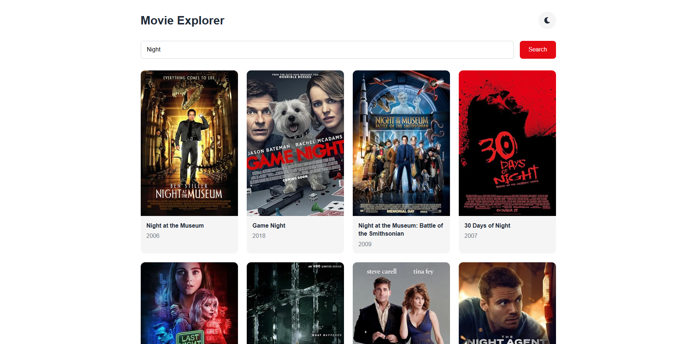
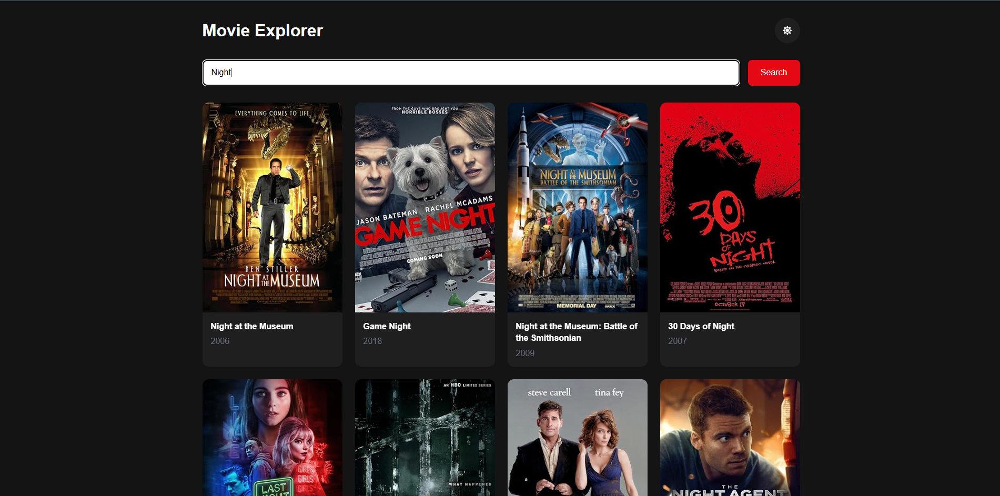
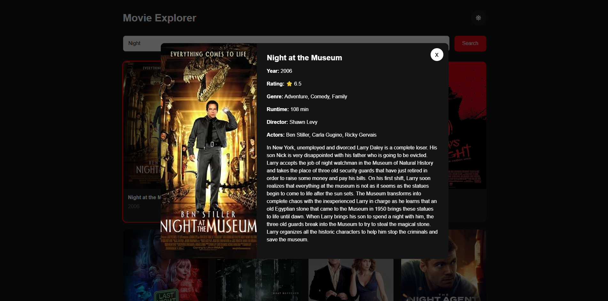
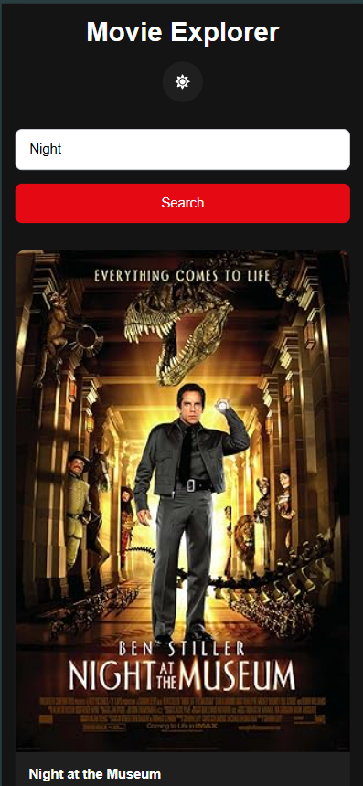
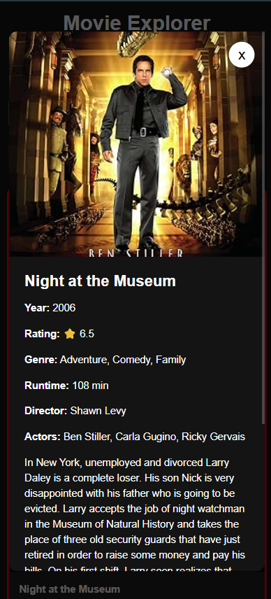

# Movie Explorer

This is a Movie Explorer application built with React, TypeScript and Vite.

## Screenshots

<table align="center">
    <tr>
        <td align="center">
            <strong>Home (Light)</strong><br><br>
            
        </td>
        <td align="center">
            <strong>Home (Dark)</strong><br><br>
            
        </td>
                <td align="center">
            <strong>Movie Details</strong><br><br>
            
        </td>
    </tr>
</table>

<table align="center">
    <tr>
        <td align="center">
            <strong>Mobile View Home (Light)</strong><br><br>
            
        </td>
        <td align="center">
            <strong>Mobile View Home (Light)</strong><br><br>
            
        </td>
    </tr>
</table>

## Live Demo

[](https://movie-explorer-ezuxtbhcm-gideonksyntengs-projects.vercel.app)

## Features

- Search movies by title
- Responsive movie grid
- Movie details modal
- Light / Dark mode
- Client-side caching
- Keyboard accessible
- Responsive design

## Tech Stack

- React
- TypeScript
- Vite
- Axios
- CSS Modules
- React Icons
- Vitest
- React Testing Library

## Installation

Clone the repository

```bash
git clone https://github.com/GideonKsynteng/movie-explorer.git
```

Install dependencies

```bash
npm install
```

## Environment Variables

Create a `.env` file.

```env
VITE_OMDB_API_KEY=YOUR_API_KEY
```

## Run

Development

```bash
npm run dev
```

Production Build

```bash
npm run build
```

## Tests

```bash
npm run test
```

Coverage

```bash
npm run test:coverage
```

## Lint

```bash
npm run lint
```

Fix issues

```bash
npm run lint:fix
```

## Project Structure

```
src
│
├── api
├── components
├── context
├── services
├── styles
├── tests
├── types
├── utils
│── pages
│
├── App.tsx
└── main.tsx
```

## Architecture

```
SearchBar

↓

MovieService

↓

Cache

↓

OMDb API

↓

MovieGrid

↓

MovieModal
```

## Responsive

Supports

- Mobile
- Tablet
- Desktop

## License

MIT
